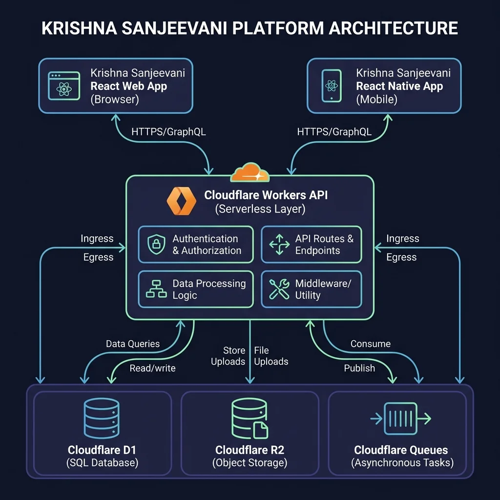
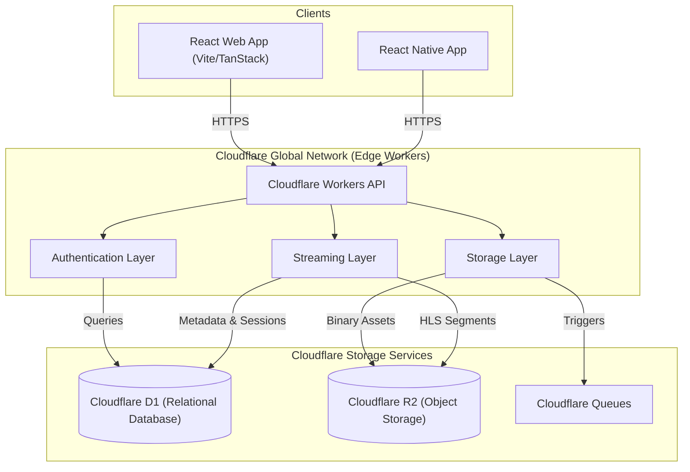
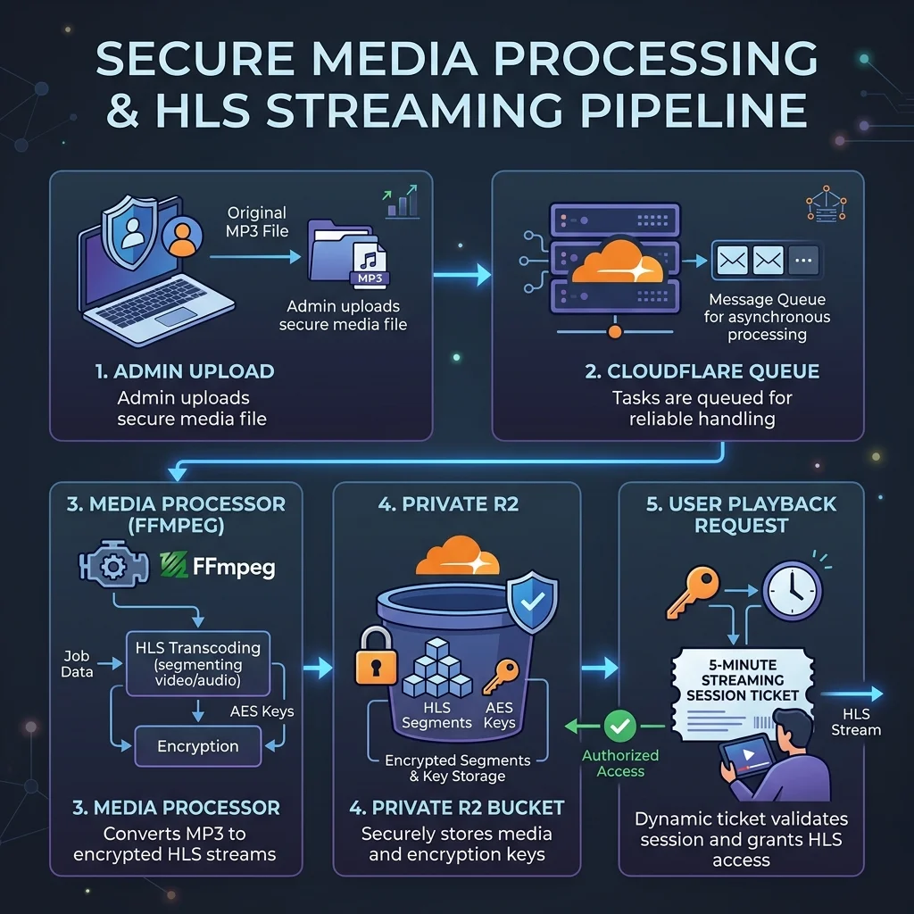
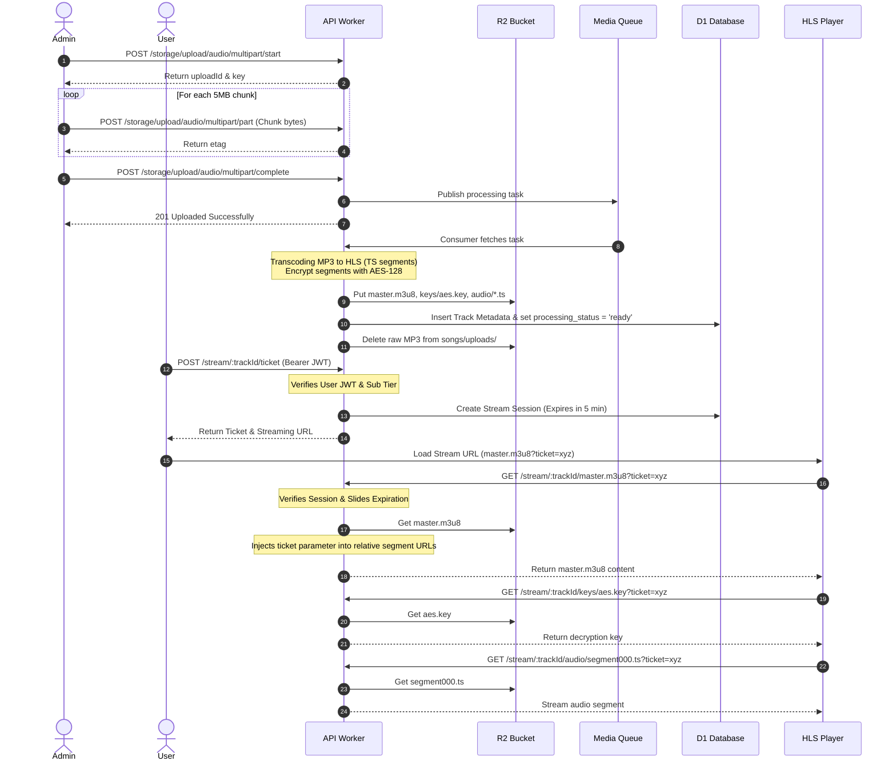

# Krishna Sanjeevani
## System Architecture & Design Decisions
**Version 1.0**

---

## 1. Executive Summary

**Krishna Sanjeevani** is a premium therapeutic audio platform streaming specialized ragas and surāvalis tailored for stress relief, sleep, focus, and pregnancy wellbeing. 

Rather than adopting a traditional monolithic server model, Krishna Sanjeevani is built on a **Cloudflare-First** serverless architecture. This design decision was made to ensure:
* **Edge Performance:** Running compute at the network edge minimizes latency globally, providing sub-100ms response times.
* **Operational Simplicity:** Zero server maintenance, automated scaling, and pay-as-you-go resource consumption.
* **Predictable Cost Control:** Standard server bandwidth costs are eliminated, particularly through Cloudflare R2's zero-egress fee model.
* **Built-in Resiliency:** High availability is guaranteed natively by Cloudflare's globally distributed network.

---

## 2. High-Level Architecture

### Component Details
* **Clients:** Frontends built using React (Web) and React Native (Mobile) utilizing HLS compliant media playback engines.
* **Worker API:** Hono-powered serverless runtime routing requests and verifying access control at the edge.
* **Cloudflare D1:** Serverless SQLite database managing relational data (Users, Profiles, Subscriptions, Track Metadata).
* **Cloudflare R2:** Secure object storage storing raw audio uploads, processed HLS streams, artwork, and thumbnails.
* **Cloudflare Queues:** Event-driven message broker decoupling raw uploads from the asynchronous media processing pipeline.

---

## 3. Technology Stack

| Component | Technology | Rationale |
| :--- | :--- | :--- |
| **Frontend Framework** | React (TanStack Start / React Native) | Promotes codebase reusability and efficient cross-platform HLS player integration. |
| **Backend Runtime** | Cloudflare Workers | Serverless JavaScript runtime executing code at the edge with zero cold starts. |
| **Web Framework** | Hono | Ultra-fast, lightweight router designed specifically for Cloudflare Workers. |
| **ORM** | Drizzle ORM | TypeScript-first ORM providing SQL-like queries with zero runtime overhead. |
| **Database** | Cloudflare D1 | Serverless SQLite database native to Cloudflare, with immediate consistency. |
| **Object Storage** | Cloudflare R2 | S3-compatible, zero-egress cost object storage for media assets. |
| **Message Broker** | Cloudflare Queues | Serverless message broker for reliable, asynchronous media transcoding triggers. |
| **Tokens & Cryptography** | JWT & JOSE | Compact, URL-safe stateless tokens signed at the edge using Web Crypto APIs. |
| **Password Hashing** | bcryptjs | Secure, industry-standard cryptographic hashing of user passwords. |
| **Streaming Protocol** | HLS + AES-128 | Segment-based HTTP Live Streaming combined with segment encryption keys. |

---

## 4. Key Architecture Decisions

### Feature-First Modular Structure
The codebase is structured by domain feature (e.g., `/modules/auth`, `/modules/storage`) rather than layered technical directories. This improves developer velocity and keeps code cohesion high.

### Cloudflare-First Backend
The entire application utilizes Cloudflare's serverless ecosystem (Workers, D1, R2, Queues) to achieve global scale, auto-scaling, and operational simplicity with zero server administration.

### Stateless API & Edge Routing
Sessions are managed statelessly using cryptographically signed JSON Web Tokens (JWTs) and rotated refresh tokens, eliminating database queries for simple session verification.

### Private Object Storage & Authenticated Proxy
The Cloudflare R2 bucket is private. The client never accesses R2 directly. Instead, a Worker acts as an authenticated proxy, verifying access rights before streaming media segments.

### Segment-based HLS Streaming
Audio files are not served as raw MP3s. Instead, they are split into AES-128 encrypted HLS `.ts` segments, preventing direct downloads, unauthorized hotlinking, and link sharing.

### Asynchronous Media Processing Pipeline
The upload API stores the raw MP3 to R2 and publishes a task to Cloudflare Queues immediately. The transcoding (HLS creation, segment generation, and database updates) is decoupled and runs asynchronously.

---

## 5. Why D1 + R2?

### Storage Type Comparison

| Criteria | Cloudflare D1 (Relational SQL) | Cloudflare R2 (Object Store) |
| :--- | :--- | :--- |
| **Primary Purpose** | Relational metadata, lookup indexes, and transactions. | Unstructured bulk data, files, and media. |
| **Data Types** | Tables, rows, keys, integers, structured strings. | Binary streams, images, archives, video/audio files. |
| **Key Strengths** | Acid-compliance, complex joins, indexing, and sorting. | Low cost, infinite scaling, no storage volume limits. |
| **Limitations** | 10GB database storage limit per namespace. | High latency for structural updates; no indexing/relations. |

### Architectural Rationales:
* **Why not store songs inside D1?** Audio binary blobs are extremely large. Storing them inside a relational database would exceed D1's 10GB namespace limit quickly and drastically degrade database query performance.
* **Why not store users inside R2?** R2 is an eventually-consistent object store. Performing login checks, email unique validations, and profile searches in R2 would require downloading JSON files, creating race conditions, high latency, and lack of relational ACID guarantees.
* **Conclusion:** R2 acts as the **"hard drive"** (optimized for streaming large binaries), while D1 acts as the **"index/memory"** (optimized for structured lookups, users, subscriptions, and relational tracking).

---

## 6. Can We Use Two R2 Buckets Instead of D1?

Technically, a developer could store the entire application state in two R2 buckets:
* **Bucket A:** Storing original audio uploads.
* **Bucket B:** Storing processed HLS directories and user metadata as JSON files (e.g., `users/user_id.json`).

However, while **possible**, it is highly **impractical** for an enterprise-scale app. R2 is an object storage system, not a database:
1. **No Indexing or Querying:** Searching for a user by email in R2 would require listing and reading all user JSON files, leading to $O(N)$ lookup costs and high Cloudflare Class A operation bills.
2. **No Relationships or FK constraints:** Linking favorites to tracks, or programs to tracks, would require manual application-level resolution, raising data corruption risks.
3. **No ACID Transactions:** Handling subscription status upgrades requires locking and atomic guarantees; R2's eventual consistency model would allow duplicate billing or state mismatches.
4. **Conclusion:** D1 and R2 are complementary. Using D1 for structured transactional metadata and R2 for unstructured media files is the only viable production pattern.

---

## 7. Security Architecture

Our security model follows a **Zero Trust Media Access** philosophy. Since any playable media can technically be recorded, our goal is to eliminate systemic leakage vector paths:

> [!IMPORTANT]
> **Core Protections Implemented:**
> * **No Direct R2 Exposure:** The R2 bucket is entirely private. It has no public endpoints or domain routing.
> * **Streaming Sessions:** Instead of exposing user JWT tokens in playback URLs (which leak into browser history and proxy logs), the frontend requests a short-lived **Streaming Session Ticket** (valid for 5 minutes).
> * **Sliding Expiration:** Each time the HLS player requests a segment or decryption key, the Worker validates the ticket and extends its lifetime by 5 minutes. If playback pauses, the session naturally expires.
> * **HLS Segment Encryption:** Audio segments are encrypted with AES-128. Without fetching the temporary decryption key (`keys/aes.key?ticket=...`), the media segments are unplayable.

---

## 8. Streaming Pipeline Flow

---

## 9. Future Scaling

To handle millions of monthly active listeners, the architecture can scale as follows:
* **Cloudflare KV:** Cache track metadata at the edge to reduce D1 read load to near-zero.
* **Durable Objects:** Maintain active, stateful user listener coordination (e.g., real-time synchronous listening).
* **Multiple Bitrates:** Transcode HLS files into multiple bitrates (64kbps, 128kbps, 256kbps) inside the pipeline for variable network adaptation.
* **Vector Search:** Utilize Cloudflare Vectorize to recommend therapeutic ragas based on user mood logs and play history.

---

## 10. Conclusion

By separating **compute** (Workers), **metadata/relations** (D1), **large binaries** (R2), and **asynchronous ingestion** (Queues), the Krishna Sanjeevani platform achieves:
1. Complete stateless horizontal scalability.
2. Low infrastructure operational costs (no database licensing or heavy server provisioning).
3. Highly secure media playback streams.

---

## 11. Architecture Decision Log (ADR Summary)

| Decision | Selected Choice | Reason / Rationale |
| :--- | :--- | :--- |
| **Backend Runtime** | **Cloudflare Workers** | Edge execution, serverless deployment, zero cold starts, and immediate global distribution. |
| **Web Server Framework** | **Hono** | Lightweight, type-safe router specifically compiled and optimized for Cloudflare Workers runtime. |
| **Database** | **Cloudflare D1** | Serverless SQLite database native to Cloudflare, eliminating TCP connection overhead. |
| **Object Storage** | **Cloudflare R2** | Private, S3-compatible object store featuring zero bandwidth egress fees. |
| **Messaging Broker** | **Cloudflare Queues** | Event-driven processing guaranteeing asynchronous task execution and error retries. |
| **Token Auth** | **JWT + Refresh Token** | Stateless edge validation, eliminating database lookups for standard requests. |
| **Auth Expiration** | **Sliding Session Ticket** | Restricts media playback URLs to a 5-minute expiry window, extending as playback continues. |
| **Decryption Standard** | **HLS + AES-128** | Dynamic segment decryption ensuring audio cannot be hotlinked or downloaded in bulk. |
