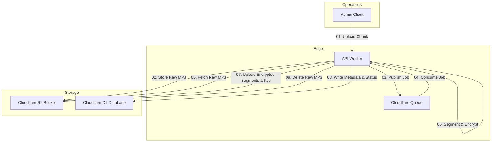

# Krishna Sanjeevani
## Secure HLS Audio Streaming & Transcoding Design (Internal Document)

This document describes the internal security protocols, encryption theories, architecture components, and end-to-end data flows for the secure HLS audio streaming pipeline implemented in the **Krishna Sanjeevani** platform.

---

## Contents
1. **System-Wide Architecture Overview**
2. **HLS & AES-128 Encryption Theory**
3. **Media Transcoding Pipeline Theory**
4. **Architecture Diagrams & Step-by-Step Flows**
   - *Flow A: Admin Audio Ingestion & Transcoding Flow*
   - *Flow B: Client Playback & Dynamic Playlist Serving Flow*
5. **Deployment Infrastructure**

---

## 1. System-Wide Architecture Overview

Krishna Sanjeevani is built on a **Cloudflare-First** serverless architecture. Rather than using traditional, heavy monolithic servers, the compute, storage, and databases run directly at the network edge to minimize latency globally and ensure high resiliency.

```
┌─────────────────────────────────────────────────────────────────────────────┐
│                          OVERALL SYSTEM ARCHITECTURE                        │
│                                                                             │
│   ┌─────────────────────┐                    ┌─────────────────────┐        │
│   │   React Web App     │                    │  React Native App   │        │
│   │   (Vite/TanStack)   │                    │      (Mobile)       │        │
│   └──────────┬──────────┘                    └──────────┬──────────┘        │
│              │                                          │                   │
│              └────────────────────┬─────────────────────┘                   │
│                                   │                                         │
│                                   ▼ (HTTPS Router Gateway)                  │
│             ┌──────────────────────────────────────────┐                    │
│             │          Cloudflare Workers API          │                    │
│             │    (Hono Router & Edge Access Control)   │                    │
│             └───────┬─────────────┬─────────────┬──────┘                    │
│                     │             │             │                           │
│       ┌─────────────┘             │             └─────────────┐             │
│       ▼                           ▼                           ▼             │
│  ┌───────────────────┐    ┌───────────────┐           ┌───────────────┐     │
│  │ Cloudflare D1 SQL │    │  Cloudflare   │           │ Cloudflare R2 │     │
│  │    (Relational    │    │    Queues     │           │   (Private    │     │
│  │     Metadata)     │    │  (Transcode)  │           │ Object Store) │     │
│  └───────────────────┘    └───────────────┘           └───────────────┘     │
└─────────────────────────────────────────────────────────────────────────────┘
```

### Component Breakdown:
* **Clients:** Web (Vite + React + TanStack Router) and Mobile (React Native) applications integrated with HLS-compliant playback engines.
* **API Workers Router:** Running on Cloudflare Workers using the lightweight Hono framework to intercept routes, authenticate users via JWT, and handle streaming requests.
* **Cloudflare D1:** Serverless SQLite database managing relational data (user accounts, listening progress, playlists, track tables, and active stream sessions).
* **Cloudflare R2:** Secure, private object storage housing track files, encrypted HLS segments, decryption keys, and page graphics/thumbnails.
* **Cloudflare Queues:** Task manager queue that decouples file upload actions from CPU-intensive transcoding operations.

---

## 2. HLS & AES-128 Encryption Theory

We implement a **Zero-Trust Media Access** model. Raw audio formats (like `.mp3` or `.wav`) are never exposed directly to client applications to eliminate downloading and link-sharing leakage points.

```
┌─────────────────────────────────────────────────────────────────────────────┐
│                 HLS AUDIO SEGMENTATION & ENCRYPTION SCHEME                  │
│                                                                             │
│                     ┌────────────────────────────────┐                      │
│                     │   Raw High-Quality MP3 File    │                      │
│                     └───────────────┬────────────────┘                      │
│                                     │                                       │
│                                     ▼                                       │
│                         [ 6-Second MP3 Segmenter ]                          │
│                                     │                                       │
│          ┌──────────────────────────┼──────────────────────────┐            │
│          ▼                          ▼                          ▼            │
│    ┌───────────┐              ┌───────────┐              ┌───────────┐      │
│    │ Segment 1 │              │ Segment 2 │              │ Segment 3 │      │
│    └─────┬─────┘              └─────┬─────┘              └─────┬─────┘      │
│          │                          │                          │            │
│          │   (AES-CBC Encryption via unique 128-bit key & dynamic IV)       │
│          ▼                          ▼                          ▼            │
│    ┌───────────┐              ┌───────────┐              ┌───────────┐      │
│    │ Encrypted │              │ Encrypted │              │ Encrypted │      │
│    │ segment001│              │ segment002│              │ segment003│      │
│    └─────┬─────┘              └─────┬─────┘              └─────┬─────┘      │
│          │                          │                          │            │
│          └──────────────────────────┼──────────────────────────┘            │
│                                     ▼                                       │
│                           Uploaded Privately to R2                          │
│        (Playlist master.m3u8 points to segments and keys/aes.key)           │
└─────────────────────────────────────────────────────────────────────────────┘
```

### Key Security Concepts:
* **HLS Segmentation:** Audio tracks are split into short 6-second segment files.
* **AES-128 Block Encryption:** Each segment is encrypted with the `AES-CBC` standard utilizing a cryptographically strong 128-bit key and random initialization vector (IV) generated during ingestion.
* **Stateless Session Tickets:** Clients must fetch a short-lived **Streaming Session Ticket** (UUID) to request playlist streams.
* **Sliding-Window Expiration:** The streaming ticket is registered in D1 database and expires in **5 minutes**. As the player plays chunks and requests segments, the backend verifies the ticket and updates its expiry by another 5 minutes (sliding window), keeping the connection alive during playback but closing it immediately if the client stops listening.

---

## 3. Media Transcoding Pipeline Theory

The media transcoding pipeline runs asynchronously using Cloudflare Queues to process raw audio uploads into encrypted segment libraries.

```
[ Upload Raw MP3 ] ──► [ Publish to Queue ] ──► [ Queue Consumer ] ──► [ Segmenter ]
                                                                             │
                                                                             ▼
[ DB track: 'ready' ] ◄── [ R2 Upload master.m3u8, aes.key & chunks ] ◄── [ Encrypt ]
```

### Key Pipeline Functions:
1. **Multi-part Ingestion:** Administrators upload large audio files to R2 in chunks, and are assigned a tracking UUID.
2. **Queue Triggering:** Once the upload finishes, a task message containing the track ID and storage keys is published to the Cloudflare Queue.
3. **Decoupled Transcoding:** The consumer worker processes tasks asynchronously, updating D1 status to `transcoding`.
4. **Segmentation & Encryption:** The worker downloads the raw MP3, slices it into 6-second segments, encrypts them using `crypto.subtle.encrypt` (AES-CBC), and writes them to the R2 target folder.
5. **Decryption Key Storage:** The decryption key (`aes.key`) is uploaded privately to R2 under `songs/processed/{trackId}/keys/aes.key`.
6. **Playlist Compilation:** Generates `master.m3u8` playlist index including the `#EXT-X-KEY` definitions pointing to the decryption key.

---

## 4. Architecture Diagrams & Step-by-Step Flows

### Flow A: Admin Audio Ingestion & Transcoding Flow



#### Step-by-Step Details:
* **01)** The admin client uploads a raw MP3 audio track using the multipart upload endpoints in [storage.route.ts](file:///c:/Users/ASUS/Desktop/Krishna-Sanjeevni/krishna-sanjeevani-flow-main/backend/src/routes/index.ts#L18).
* **02)** The [StorageService](file:///c:/Users/ASUS/Desktop/Krishna-Sanjeevni/krishna-sanjeevani-flow-main/backend/src/modules/storage/storage.service.ts) streams the chunks and compiles them inside R2.
* **03)** Upon upload completion, the API worker publishes a task containing the `{ trackId, key, size }` payload to the Cloudflare Queue.
* **04)** The asynchronous queue worker consumer fetches the task message and invokes the `queue()` handler in [index.ts](file:///c:/Users/ASUS/Desktop/Krishna-Sanjeevni/krishna-sanjeevani-flow-main/backend/src/index.ts#L15).
* **05)** The consumer downloads the raw MP3 binary from the R2 bucket.
* **06)** The handler updates the track's status to `transcoding` in D1, then calls `segmentMp3` to split the file.
* **07)** The worker generates a new random 128-bit AES key and IV, encrypts each segment, and uploads the `.mp3` chunks and key file (`aes.key`) back to R2.
* **08)** The worker compiles the index playlist (`master.m3u8`) detailing the `#EXT-X-KEY` scheme and writes the track metadata and paths to D1 with status `ready`.
* **09)** The worker deletes the raw uploaded MP3 from R2 to conserve space.

---

### Flow B: Client Playback & Dynamic Playlist Serving Flow

```
┌─────────────────────────────────────────────────────────────────────────────┐
│                 CLIENT PLAYBACK TICKET & PLAYLIST SERVINGS                  │
│                                                                             │
│  1. Client Requests Ticket  ──► [ API Worker ]                              │
│                                      │ (Verifies Role / Premium Sub)        │
│                                      ▼                                      │
│  2. Generate UUID Session   ──► Stores ticket in D1 with 5-Min Expiry       │
│  3. Return Endpoint URL     ──► master.m3u8?ticket=xyz                      │
│                                                                             │
│  4. Client HLS Player requests master.m3u8?ticket=xyz                       │
│     [ Hono API Worker ] interceptor:                                        │
│       ├── (a) Validates ticket in D1.                                       │
│       ├── (b) Extends ticket lifespan by +5 minutes (sliding window).        │
│       ├── (c) Fetches static master.m3u8 from R2.                           │
│       └── (d) Rewrites playlist lines:                                      │
│               FROM: URI="keys/aes.key"                                      │
│               TO:   URI="keys/aes.key?ticket=xyz"                           │
│                     audio/segment001.mp3?ticket=xyz                         │
└─────────────────────────────────────────────────────────────────────────────┘
```

```mermaid
graph TD
    subgraph Playback Client
        Player["HLS Player Component"]
    end

    subgraph Edge Worker Routing
        Worker["API Worker"]
    end

    subgraph Backend Services
        D1["D1 Database"]
        R2["R2 Private Storage"]
    end

    Player -->|01. Request Streaming Ticket| Worker
    Worker -->|02. Verify Subscription & Role| D1
    Worker -->|03. Insert Session Ticket| D1
    Worker -->|04. Return Ticket URL| Player
    Player -->|05. Fetch master.m3u8?ticket=xyz| Worker
    Worker -->|06. Verify & Extend Session Ticket| D1
    Worker -->|07. Fetch Static master.m3u8| R2
    Worker -->|08. Rewrite Playlist (Inject Tickets)| Worker
    Worker -->|09. Return Modified Playlist| Player
    Player -->|10. Fetch aes.key & audio segments| Worker
    Worker -->|11. Verify Ticket & Fetch Chunks| R2
    Worker -->|12. Stream Decoded Audio| Player
```

#### Step-by-Step Details:
* **01)** The client requests a playback ticket by calling `POST /api/v1/stream/:trackId/ticket` with their Bearer JWT token.
* **02)** The streaming router [stream.route.ts](file:///c:/Users/ASUS/Desktop/Krishna-Sanjeevni/krishna-sanjeevani-flow-main/backend/src/routes/stream.route.ts#L171) verifies the user's login session and validates that they have an active premium subscription (if the track tier is `premium`).
* **03)** If verification passes, the worker generates a unique ticket (UUID) and stores it in D1 with a 5-minute sliding expiration.
* **04)** The worker responds to the client with the ticket and the player endpoint: `/api/v1/stream/:trackId/master.m3u8?ticket=TICKET`.
* **05)** The player requests the HLS master playlist from Hono.
* **06)** The [verifyAndExtendSession](file:///c:/Users/ASUS/Desktop/Krishna-Sanjeevni/krishna-sanjeevani-flow-main/backend/src/routes/stream.route.ts#L22) function validates the incoming ticket, checks browser request headers (`Referer` & `Sec-Fetch-Site`) to prevent direct link downloads, and extends the session ticket lifetime by another 5 minutes in D1.
* **07)** The worker fetches the static `master.m3u8` playlist index from R2.
* **08)** The worker dynamically parses the text file and appends the `ticket=TICKET` query parameter to the decryption key path and all relative segment paths (e.g., `keys/aes.key?ticket=xyz` and `audio/segment000.mp3?ticket=xyz`).
* **09)** The worker returns the modified playlist to the player.
* **10)** The player parses the playlist, requests the AES decryption key, and fetches consecutive segment files.
* **11)** For each incoming segment and key request, the worker intercepts the call, validates the ticket session, and retrieves the respective chunk from R2.
* **12)** The player receives the encrypted chunks, decrypts them locally using the retrieved `aes.key`, and streams the audio smoothly.

---

## 5. Deployment Infrastructure

Krishna Sanjeevani relies on Cloudflare's serverless network, which does not require dedicated active-passive load balancers.

```
                             [ Cloudflare Global Edge ]
                                         │
                 ┌───────────────────────┼───────────────────────┐
                 ▼                       ▼                       ▼
          [ Edge Worker ]         [ Edge Worker ]         [ Edge Worker ]
                 │                       │                       │
                 └───────────┬───────────┴───────────┬───────────┘
                             ▼                       ▼
                      [ Cloudflare R2 ]       [ Cloudflare D1 ]
```

### Infrastructure Specs:
* **Edge Compute (Cloudflare Workers):** Backend Hono routes are deployed as serverless edge workers, executing globally close to users with no cold starts.
* **Storage (Cloudflare R2):** Private, S3-compatible storage with zero-egress bandwidth fees.
* **Relational Store (Cloudflare D1):** SQLite database replicated at the edge for low latency read operations.
* **Message Ingestion (Cloudflare Queues):** Auto-scaling queue buffers to coordinate asynchronous worker threads.

---

> [!WARNING]
> **Production Integration Warning:**
> Under no circumstances should the private keys directory (`songs/processed/{trackId}/keys/`) be exposed via R2 bucket policies or custom public domains. Disabling ticket validation will result in immediate leakage of copyrighted audio files.
